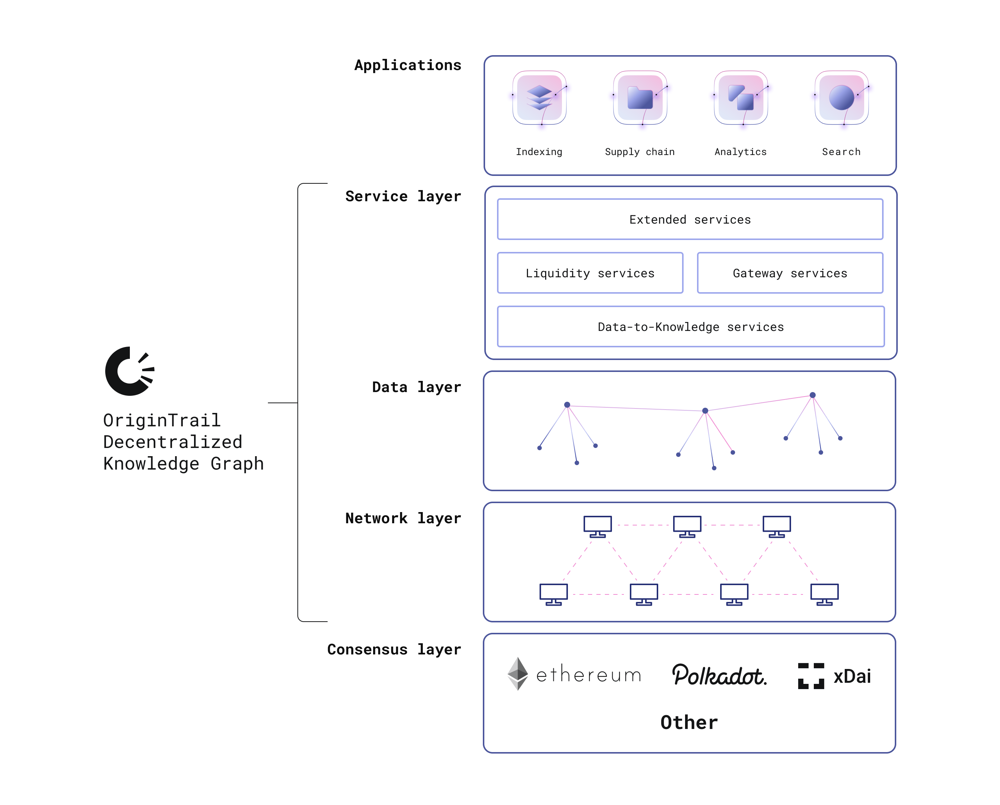

# OriginTrail - Decentralized Knowledge Graph \(DKG\)

We define the **Decentralized knowledge graph \(DKG\)** as a global shared knowledge graph that is designed to benefit organizations and individuals by providing a common infrastructure for data exchange. The DKG:

* Enables Dapps with search, integration, analytics, AI and ML capabilities for any data source: blockchains, IPFS, enterprise systems, web services, personal devices
* Removes central authorities \(decentralized infrastructure\)
* Enables permissionless PUBLISH and QUERY \(public network\)
* Decentralized identity & Verifiable Credentials based access control \(references private data\)

**TO DO:**

* explain architecture, 
* explain system actors 
* explain protocols
* explain data layers

The main concern about trust between organizations is who owns and has access to modify the data. As such we introduced in 2018 the OriginTrail Decentralized Knowledge graph \(ODN\), to ensure data is immutable and no party has ownership over the data once it is uploaded to ODN.

Dataset are uploaded on ODN through a Data Creator node, which could be from any number of business functions, including existing ERPs, blockchains \(permissioned and permissionless\), etc. A cryptographic data hash of the data is first fingerprinted to a blockchain to ensure data immutability. This data is then passed \(via a bidding process through a smart contract\) to three Data Holder nodes that agree to hold the data for the terms of a contract. Data holder nodes are essentially decentralized, interconnected servers and provide that data upon demand to relevant parties. 

ODN is integrated to Ethereum and xDAI blockchains, where businesses and users can choose which one they prefer based on their preferences in terms of fees and security. Upcoming integration to Polkadot is planned for Q3 2021.

The bidding process is completely random and cannot be influenced in any way by any of the parties. Payment is utilized through the Trace Token \(TRAC\) which is the glue between all entities and is used as both a stake \(to keep data holders honest and data immutable\) and a payment \(to compensate data holders for their time and resources\). More information on TRAC utility and economics can be found [HERE](trac.md).

Data creators can [set the data to be public or private](https://medium.com/origintrail/linking-data-in-supply-chains-to-bring-much-needed-resilience-to-global-businesses-8a2ed51cc928), have the data expire after a required time \(i.e. months or years\), or have that data \(or parts of data\) shared only with appropriate parties. Sensitive data is protected using zero-knowledge methods in a privacy-by-design approach. These data holding nodes also function as a vast, decentralized knowledge graph to connect data sets across companies/users quickly and efficiently. This core feature of the ODN is a groundbreaking utility of the protocol, as searching for inter-related data between partners has not been possible before.

